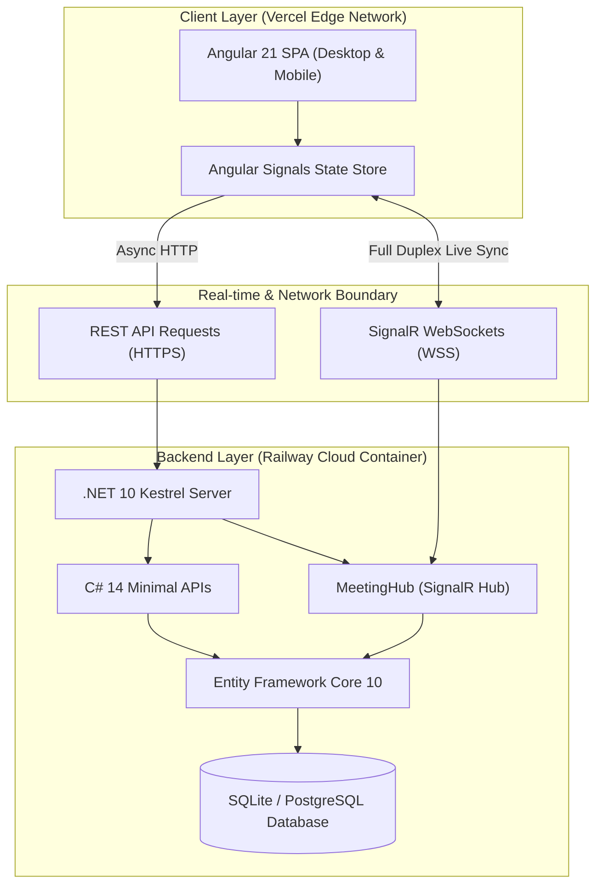

# DeskFlow Rooms — Enterprise Workplace Collaboration OS

> A high-performance, real-time meeting room reservation and workplace facility system designed for modern hybrid enterprises. Engineered with **.NET 10 LTS (C# 14 Minimal APIs)** and **Modern Angular 21 (Signals & Standalone Components)**, powered by **SignalR WebSockets** for live attendance synchronization.

---

## 📌 Portfolio Showcase & Architecture Disclaimer

> [!NOTE]
> **ระบบนี้จัดทำขึ้นเป็น Interactive Portfolio Demo เพื่อโชว์ผลงานด้าน Full-Stack Architecture**
> 
> เพื่อให้ผู้ตรวจผลงานและผู้สนใจสามารถทดสอบโฟลว์การทำงานได้ทันทีโดยไม่ต้องผ่านขั้นตอนการลงทะเบียนที่ซับซ้อน ระบบจึงออกแบบให้มี **Employee Persona Switcher** ให้คุณสามารถสลับบทบาทระหว่าง **Admin (ผู้ดูแลอาคาร)** และ **Employee (พนักงานทั่วไป)** ได้เพียง 1 คลิก
> 
> 🛡️ **ในระบบการใช้งานจริงระดับองค์กร (Production Enterprise Ready)**:
> ระบบจะมีการจัดการเรื่องความปลอดภัยและการระบุตัวตนอย่างเข้มงวดผ่าน:
> - **Enterprise SSO / OAuth 2.0 & OpenID Connect**: รองรับการเชื่อมต่อกับ **Microsoft Entra ID (Azure AD)** หรือ Google Workspace
> - **JWT Authentication & RBAC Middleware**: ตรวจสอบ Bearer Token และ Claim-based Authorization (`Role: Admin`, `Role: FacilityManager`, `Role: Employee`)
> - **Audit Logging**: เก็บบันทึกประวัติการแก้ไขข้อมูลอาคารและประวัติการเข้าใช้งานตามมาตรฐาน SOC2 / ISO 27001

---

## 🏢 Problems We Solve

1. **Ghost Bookings & Room Hoarding**: พนักงานจองห้องไว้แต่ไม่มาใช้งาน ทำให้ห้องว่างแต่ผู้อื่นจองไม่ได้
2. **Missing Invitation RSVP**: ระบบจองห้องทั่วไปไม่มีการตอบรับการเข้าประชุมล่วงหน้า ทำให้ผู้จัดไม่ทราบจำนวนผู้เข้าร่วมที่แท้จริง
3. **Multi-Floor Chaos**: การจัดการห้องประชุมในอาคารขนาดใหญ่ที่กระจายตัวหลายชั้น ขาดระบบคัดกรองตามชั้นที่สะดวกรวดเร็ว
4. **Outdated Enterprise Clutter**: ซอฟต์แวร์สำนักงานส่วนใหญ่มี UI ที่ซับซ้อน เข้าใจยาก และดีไซน์ไม่สอดคล้องกับพฤติกรรมการทำงานยุคใหม่

---

## ✨ Core Features

- 🤝 **Microsoft Teams-Style RSVP Engine**:
  - ผู้เข้าร่วมประชุมสามารถกด **Accept (ยอมรับ)** หรือ **Decline (ปฏิเสธ)** คำเชิญล่วงหน้าได้ทันที
  - อัปเดตสถานะแบบเรียลไทม์ผ่าน **SignalR WebSockets** พร้อม Facepile แสดงจุดสถานะ (🟢 Accepted, 🟡 Pending, 🔴 Declined)
- 🏢 **Multi-Floor Building Management (Admin Role)**:
  - ผู้ดูแลระบบสามารถเพิ่มชั้นใหม่ (Add Floor), ลบชั้นที่ไม่มีห้องใช้งาน (Delete Floor)
  - กำหนดห้องประชุมลงในชั้นที่ต้องการ (Floor 12, Floor 14, Floor 15 ฯลฯ)
  - ฟิลเตอร์ห้องประชุมตามชั้นด้วย Custom Accessible Popover Dropdown (ไร้ unstyled native select)
- 🔒 **Role-Based Access Control (RBAC)**:
  - แยกมุมมองระหว่าง **Admin** และ **Employee** ชัดเจน พนักงานทั่วไปจะไม่เห็นปุ่มจัดการชั้นหรือปุ่มเพิ่ม/ลบห้องประชุม
- 🎨 **Dribbble & .NET MAUI Beautiful UI Inspired**:
  - ดีไซน์สไตล์ Light-Mode Workplace OS สบายตา เหมาะสำหรับบรรยากาศการทำงานในออฟฟิศ
  - มาตรฐาน **Zero-Slop UI**: ใช้ Vector SVG 100% (ไม่มีอิโมจิหลุดปน), ปุ่มมีความสูงสม่ำเสมอ (`h-8`/`h-10`), และมี Modal Dismissal Hierarchy ที่ได้มาตรฐาน

---

## 🛠️ Technology Stack

| Layer | Technology | Key Highlights |
|---|---|---|
| **Backend API** | **C# .NET 10 LTS** | Minimal APIs, C# 14, Native OpenAPI 3.1, High-throughput Kestrel |
| **Real-time Engine** | **ASP.NET Core SignalR** | Full-duplex WebSockets, automatic reconnection & broadcasting |
| **ORM & Database** | **Entity Framework Core 10** | SQLite (with ready migration to PostgreSQL / SQL Server) |
| **Frontend Framework** | **Angular 21** | Standalone Single-File Components, Angular Signals (`signal`, `computed`), Vite HMR |
| **Styling & Design** | **Tailwind CSS** | Custom micro-animations, glassmorphic headers, design tokens |
| **Hosting & CI/CD** | **Railway.app & Vercel** | Multi-stage Dockerized API (.NET 10) + Static SPA Edge Network |

---

## 🏗️ System Architecture



---

## 🚀 Local Development Setup

### Prerequisites
- [.NET 10 SDK](https://dotnet.microsoft.com/download)
- [Node.js 20+ & npm](https://nodejs.org/)

### 1. Run Backend API
```powershell
# Navigate to backend directory
cd backend/DeskFlow.Api

# Restore and run server on port 5000
dotnet run --urls http://localhost:5000
```
API Documentation & OpenAPI will be active at `http://localhost:5000/openapi/v1.json`.

### 2. Run Frontend Web App
```powershell
# Navigate to frontend directory
cd frontend

# Install dependencies & start dev server
npm install
npm start
```
Open your browser at **`http://localhost:4200`**.

---

## ☁️ Cloud Deployment (Railway + Vercel)

### Step 1: Deploy Backend to Railway.app
1. เข้าไปที่ [Railway.app](https://railway.app) และกด **New Project** -> **Deploy from GitHub repo**
2. เลือก Repository นี้ และระบุ Root Directory เป็น `/backend/DeskFlow.Api`
3. Railway จะตรวจพบ `Dockerfile` (.NET 10) อัตโนมัติและทำการ Build & Deploy
4. ในหน้า **Settings** -> **Networking** ให้กด **Generate Domain** คุณจะได้ URL เช่น:  
   `https://deskflow-api-production.up.railway.app`

### Step 2: Deploy Frontend to Vercel
1. เข้าไปที่ [Vercel.com](https://vercel.com) และกด **Add New Project**
2. นำเข้า Repository นี้ และตั้งค่า **Root Directory** เป็น `frontend`
3. Vercel จะตรวจพบการตั้งค่าจาก `vercel.json` โดยอัตโนมัติ:
   - **Framework Preset**: Angular
   - **Build Command**: `npm run build`
   - **Output Directory**: `dist/frontend/browser`
4. กด **Deploy** จะได้เว็บสดพร้อมใช้งาน!

---

## 📄 License
This project is licensed under the MIT License - open for study, architectural reference, and portfolio showcases.
