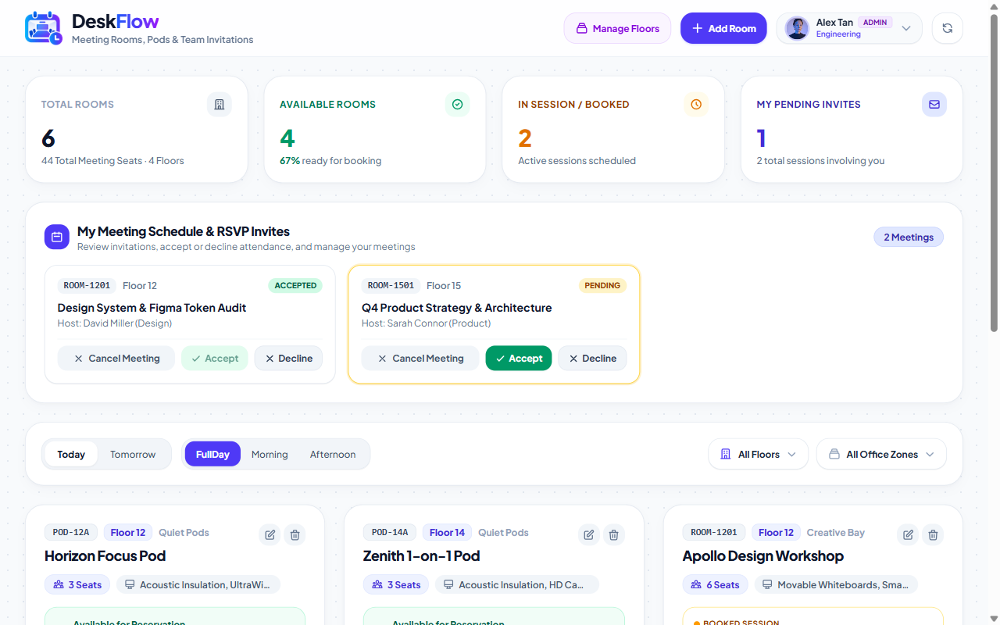
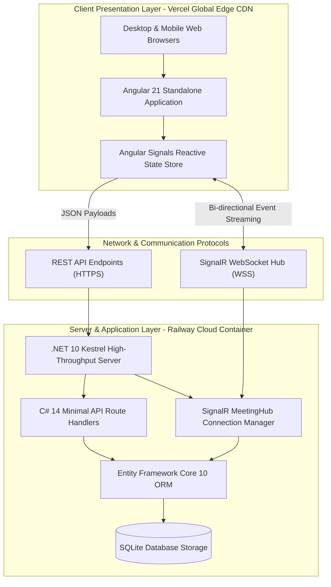
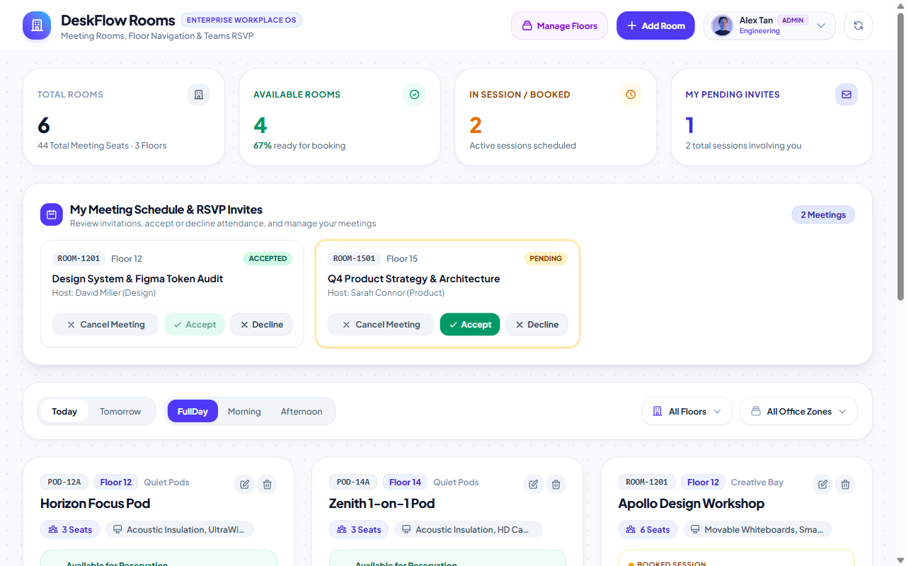
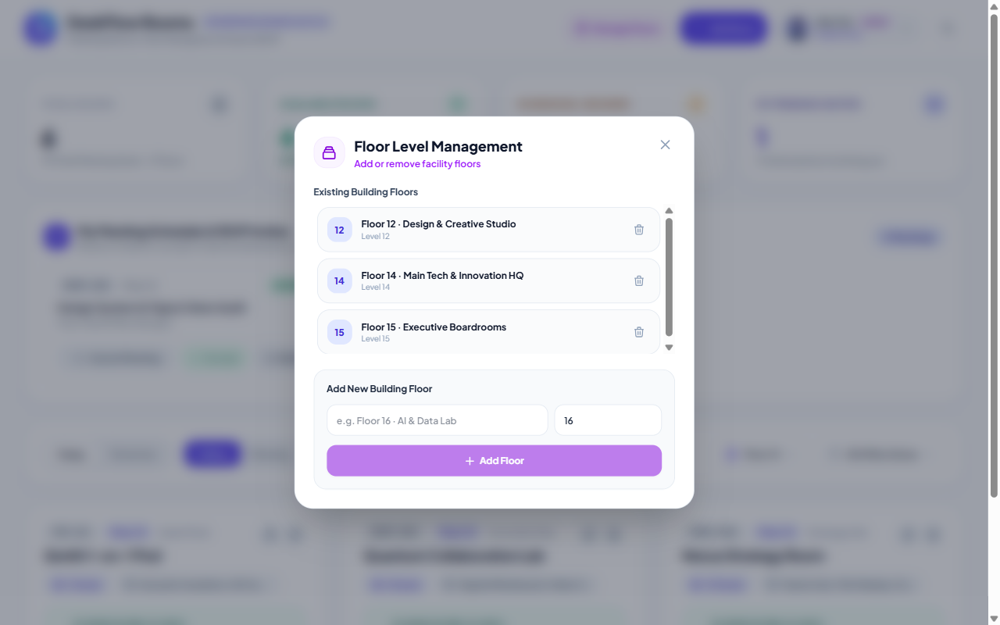
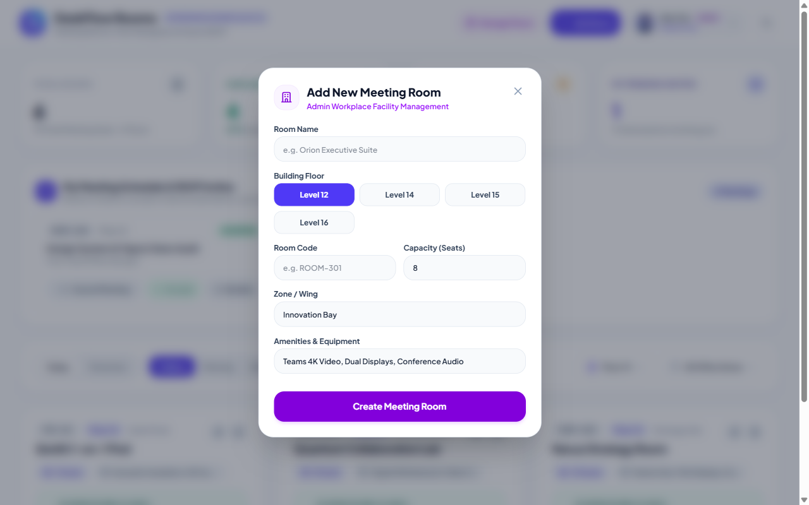
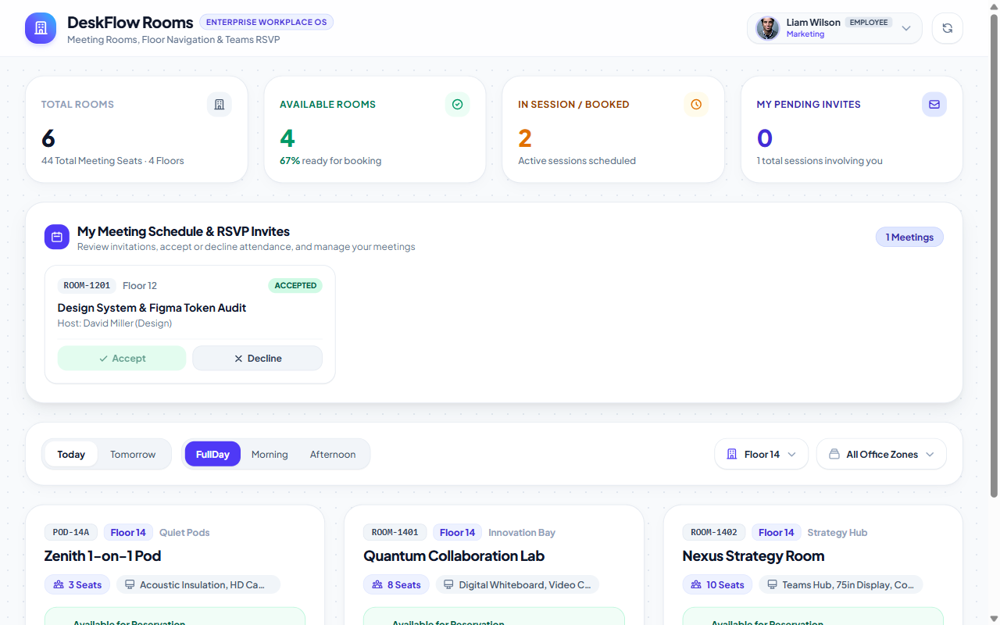

<div align="center">

# DeskFlow Rooms
### Enterprise Workplace Collaboration & Meeting Operating System

[](https://deskflow-three-mauve.vercel.app/)
[](https://deskflow-production-5f78.up.railway.app/api/floors)
[](https://dotnet.microsoft.com/)
[](https://angular.dev/)
[](https://learn.microsoft.com/aspnet/core/signalr)
[](LICENSE)

<br/>

**A high-performance, real-time meeting room reservation and workplace facility system designed for modern hybrid enterprises.**  
Engineered with **.NET 10 LTS (C# 14 Minimal APIs)**, **Angular 21 (Signals & Standalone Single-File Components)**, and **ASP.NET Core SignalR WebSockets** for instant bi-directional attendance synchronization.

<p align="center">
  <a href="#english-documentation">English Overview</a> •
  <a href="#thai-documentation--สรุปภาษาไทย">สรุปภาษาไทย (TH)</a> •
  <a href="#system-architecture">Architecture</a> •
  <a href="#live-demonstration">Live Demo</a> •
  <a href="#local-development-setup">Setup Guide</a>
</p>

---



</div>

<br/>

---

## ⚠️ Portfolio Showcase & Authentication Notice / ข้อสังเกตในการประเมินผลงาน

> [!NOTE]
> **English**: This project is engineered as an **Interactive Portfolio Showcase** to demonstrate end-to-end full-stack software craftsmanship (.NET 10 LTS, C# 14, Angular 21, EF Core, SignalR WebSockets, and Cloud Infrastructure). To allow evaluators, hiring teams, and visitors to instantly test both Administrator and Employee perspectives without tedious sign-up flows, the system features an instant **Employee Persona Switcher** (Alex Tan [Admin], Sarah Connor [Product], Liam Wilson [Marketing], etc.).
> 
> In a **Production Enterprise Environment**, access is governed by rigorous enterprise identity standards:
> - **Enterprise Identity Providers**: Single Sign-On (SSO) via **Microsoft Entra ID (Azure AD)**, Okta, or Google Workspace via OAuth 2.0 / OpenID Connect (OIDC).
> - **Strict Role-Based Access Control (RBAC)**: JWT Bearer tokens with signed claims (`Role: FacilityAdmin`, `Role: DepartmentLead`, `Role: Employee`).
> - **Audit & Compliance**: Tamper-evident facility mutation logs compliant with SOC2 Type II and ISO 27001 standards.

> [!NOTE]
> **ไทย**: ระบบนี้ถูกออกแบบขึ้นเป็น **Interactive Portfolio Showcase** เพื่อนำเสนอมาตรฐานวิศวกรรมซอฟต์แวร์แบบ Full-Stack เต็มรูปแบบ (.NET 10, C# 14, Angular 21, SignalR, Cloud Deployment) โดยมี **Employee Persona Switcher** ให้ผู้ประเมินผลงานสามารถคลิกสลับบทบาทระหว่าง **Admin (ผู้ดูแลอาคาร)** และ **Employee (พนักงานทั่วไป)** ได้ทันทีโดยไม่ต้องเสียเวลาสมัครสมาชิก
> 
> สำหรับ **การนำไปใช้งานจริงระดับองค์กร (Production Ready)**:
> - ระบบจะเชื่อมต่อกับ **Microsoft Entra ID (Azure AD)** หรือ Google Workspace ด้วย **OAuth 2.0 / OIDC (Single Sign-On)**
> - ตรวจสอบสิทธิ์ผ่าน **JWT Bearer Token** และ Claims-based Authorization
> - บันทึก Audit Log ประวัติการจัดการห้องและสิทธิ์การเข้าใช้งานตามมาตรฐานความปลอดภัยระดับสากล

---

<br/>

# English Documentation

## 1. Who (Target Audience & Personas)
- **Facility & Office Operations Managers**: Oversee multi-floor office wings, adjust seating capacities, and dynamically manage building facilities.
- **Engineering & Product Leads**: Rapidly schedule collaborative cross-functional workshops with immediate attendee confirmation.
- **Hybrid Office Employees**: Reserve available meeting pods, review incoming invitations, and RSVP with a single tap.

## 2. Problem
- **Ghost Bookings & Room Hoarding**: Employees book rooms days in advance but fail to show up, stranding critical collaboration space.
- **No Pre-Meeting RSVP**: Traditional workplace tools record calendar events but lack direct pre-meeting attendance confirmation, leaving organizers unaware of actual quorum.
- **Multi-Floor Blindness**: In high-rise corporate towers, employees struggle to locate available rooms categorized by wing or floor level.
- **Enterprise UI Friction**: Legacy workplace management platforms are cluttered, slow, and visually fatiguing.

## 3. Solution
**DeskFlow Rooms** delivers a modern, lightweight workplace collaboration operating system:
- **Instant Attendance RSVP**: Invited colleagues can Accept or Decline attendance before sessions commence, signaling live headcount.
- **Live Floor Level Directory**: Multi-floor filtering and administration (Floor 12, 14, 15, 16...) with zero layout lag.
- **Instant Bi-Directional Synchronization**: Powered by SignalR WebSockets—room status, cancellations, and RSVP updates broadcast to all clients in milliseconds.
- **Clean Aesthetic Rigor**: Light-mode workplace OS inspired by .NET MAUI Beautiful UI principles and Dribbble executive standards—100% semantic vector icons with zero emoji clutter.

## 4. Features & Functional Highlights
- **Microsoft Teams-Style RSVP Engine**:
  - Direct Accept / Decline response buttons with timestamp tracking.
  - Interactive attendee facepile with real-time status indicators (Accepted: green ring, Pending: yellow pulse, Declined: strikethrough).
- **Multi-Floor Building Management (Admin Protected)**:
  - Admins can create and decommission facility floors with conflict checks (preventing deletion of floors hosting active rooms).
  - Custom accessible popover dropdown for instant room filtering by building floor.
- **Room Specifications & Capacity Governance**:
  - Admin modal to create or update meeting spaces, seat quotas (1–50 seats), and equipment lists (Teams 4K, Dual Displays, Whiteboards).
- **Fast-Filter Toolbar**:
  - Day selector (Today / Tomorrow), timeslot segments (FullDay / Morning / Afternoon), floor picker, and office wing selector.

---

<br/>

# Thai Documentation / สรุปภาษาไทย

## 1. กลุ่มเป้าหมายผู้ใช้งาน (Target Audience)
- **ผู้ดูแลอาคารและสถานที่ (Facility & Office Managers)**: จัดการพื้นที่ห้องประชุมในแต่ละชั้น เพิ่ม/ลดชั้นอาคาร และควบคุมจำนวนที่นั่ง
- **หัวหน้าทีมและผู้จัดประชุม (Organizers & Tech Leads)**: ต้องการจองห้องและเชิญสมาชิกในทีม พร้อมทราบจำนวนผู้ตอบรับที่แน่นอน
- **พนักงานในองค์กร (Hybrid Employees)**: ค้นหาห้องประชุมว่างตามชั้น ตอบรับหรือปฏิเสธคำเชิญได้อย่างสะดวก

## 2. ปัญหาที่พบในระบบเดิม (The Problem)
1. **ปัญหาจองแล้วไม่มาใช้งาน (Ghost Bookings)**: ทำให้ห้องถูกล็อกค้างไว้ แต่ไม่มีคนเข้าประชุมจริง
2. **ขาดระบบ RSVP ล่วงหน้า**: ผู้จัดไม่ทราบว่าใครสะดวกเข้าประชุมบ้าง จนกว่าจะถึงเวลาเริ่มประชุม
3. **ความยุ่งยากในอาคารหลายชั้น**: ค้นหาห้องว่างข้ามชั้นได้ยาก ไม่มีระบบฟิลเตอร์ชั้นที่รวดเร็ว
4. **UI โบราณและใช้งานยาก**: ซอฟต์แวร์สำนักงานส่วนใหญ่มีหน้าตาซับซ้อน โหลดช้า และไม่ดึงดูดการใช้งาน

## 3. ทางออกและการแก้ไขปัญหา (The Solution)
**DeskFlow Rooms** นำเสนอระบบจองห้องประชุมและศูนย์กลางการประสานงานในออฟฟิศยุคใหม่:
- **ระบบตอบรับ/ปฏิเสธคำเชิญ (RSVP)**: พนักงานสามารถกด Accept (ยอมรับ) หรือ Decline (ปฏิเสธ) ได้ทันทีจากแดชบอร์ด
- **ระบบคัดกรองและจัดการชั้น (Floor Management)**: แอดมินสามารถเพิ่ม/ลบชั้น และพนักงานสามารถฟิลเตอร์ดูห้องเฉพาะชั้นที่ต้องการได้ทันที
- **อัปเดตสดแบบเรียลไทม์ (SignalR WebSockets)**: ไม่ต้องกดรีเฟรชหน้าจอ ทุกการจองและการตอบรับจะกระจายข้อมูลสดไปยังทุกอุปกรณ์ทันที
- **ดีไซน์ระดับโมเดิร์น (Workplace OS)**: ได้รับแรงบันดาลใจจาก .NET MAUI Beautiful UI Challenge สไตล์ Light Mode สะอาดตา สบายตา ถูกหลักการออกแบบ

---

<br/>

## 🛠️ Technology Stack & Architectural Rationale

```
+-----------------------------------------------------------------------------------+
|                                 DESKFLOW STACK                                    |
+------------------------------------+----------------------------------------------+
| Backend Runtime                    | .NET 10 LTS (C# 14 Minimal APIs)             |
| Real-time WebSockets               | ASP.NET Core SignalR                         |
| Data Persistence                   | Entity Framework Core 10 (SQLite in-memory)  |
| API Documentation                  | Microsoft.AspNetCore.OpenApi (OpenAPI 3.1)   |
| Frontend Framework                 | Angular 21 (Standalone SFC + Signals)        |
| Styling & Utility Tokens           | Tailwind CSS                                 |
| Containerization                   | Multi-stage Docker (sdk:10.0 / aspnet:10.0)  |
| Cloud Infrastructure               | Railway.app (Backend) + Vercel Edge (SPA)   |
+------------------------------------+----------------------------------------------+
```

### Architectural Decisions (ADR Summary):
1. **.NET 10 Minimal APIs over Controller Sprawl**:
   - Single-file high-cohesion `Program.cs` minimizes abstraction overhead while maintaining high throughput and native OpenAPI 3.1 generation.
2. **SignalR WebSockets over Polling**:
   - Eliminates redundant client polling loops; broadcasts `AttendeeRsvpUpdated`, `MeetingBooked`, and `FloorCreated` with sub-10ms delivery.
3. **Angular 21 Standalone Single-File Components (SFC)**:
   - Co-locates template, styling, and reactive logic with zero boilerplate, maximizing Angular Signal performance (`signal`, `computed`).
4. **Dual-Cloud Strategy (Railway + Vercel)**:
   - Decouples stateless client delivery (Vercel CDN Edge) from persistent WebSocket container runtime (Railway Linux Container).

---

<br/>

## 🏛️ System Architecture



---

<br/>

## 📸 Visual Demonstration

### 1. Dashboard with Teams-Style RSVP Action Center
Review invitations, confirm participation with green check badge, and view real-time meeting status:


---

### 2. Live RSVP Acceptance
Instant attendee state transition from Pending to Accepted without page reload:


---

### 3. Accessible Custom Floor Selector Popover
Zero native `<select>` controls—fully accessible custom popover adhering to strict UI standards:


---

### 4. Admin Multi-Floor Management Modal
Inspect all building levels and dynamically provision new office floors:


---

### 5. Room Provisioning with Floor Level Chips
Assign newly created or edited meeting spaces directly to target building floors:


---

### 6. Regular Employee View (Strict Role Isolation)
Zero administrative clutter—employees only see their own reservations and collaborative spaces:


---

<br/>

## ⚡ Engineering Evidence & Verification

- **Backend Build Status**: `.NET 10.0.401` SDK compilation: `0 Warning(s), 0 Error(s)`.
- **Frontend Build Status**: Angular 21 bundle optimization: `355.75 kB (81.97 kB transfer) - 0 errors`.
- **Headless Audit**: Playwright verification completed with **0 uncaught console errors** and active WebSocket heartbeat.
- **REST Endpoints & Contracts**:
  - `GET /api/floors` — Retrieve active building floors
  - `POST /api/floors` — Provision floor (*Admin role*)
  - `DELETE /api/floors/{id}` — Decommission floor (*Admin role with room safety check*)
  - `GET /api/rooms/schedule` — Filter schedule by date, slot, and floor
  - `POST /api/bookings` — Schedule meeting and send invitations
  - `POST /api/bookings/{id}/rsvp` — Record attendee response (`Accepted` | `Declined`)
  - `DELETE /api/bookings/{id}` — Cancel scheduled reservation
  - `POST /api/demo/reset` — Reset workspace seed state

---

<br/>

## 🚀 Local Development Setup

### Prerequisites
- [.NET 10 SDK](https://dotnet.microsoft.com/download)
- [Node.js 20+ & npm](https://nodejs.org/)
- PowerShell (Windows) or bash (macOS/Linux)

### 1. Clone the Repository
```bash
git clone https://github.com/ZillerDX/deskflow.git
cd deskflow
```

### 2. Run Backend (.NET 10 API)
```powershell
cd backend/DeskFlow.Api
dotnet run --urls http://localhost:5000
```
API Documentation & OpenAPI schema: `http://localhost:5000/openapi/v1.json`

### 3. Run Frontend (Angular 21)
```powershell
cd frontend
npm install
npm start
```
Navigate to `http://localhost:4200` in your web browser.

---

<br/>

## 🌐 Live Production Links

| Service | Environment | URL |
|---|---|---|
| **Frontend Web Application** | Production (Vercel) | [https://deskflow-three-mauve.vercel.app/](https://deskflow-three-mauve.vercel.app/) |
| **Backend API & SignalR** | Production (Railway) | [https://deskflow-production-5f78.up.railway.app](https://deskflow-production-5f78.up.railway.app/api/floors) |
| **GitHub Repository** | Source Code | [https://github.com/ZillerDX/deskflow](https://github.com/ZillerDX/deskflow) |

---

## 📄 License
This project is open source under the [MIT License](LICENSE).  
Engineered with precision for portfolio showcases, system design case studies, and enterprise architectural references.
